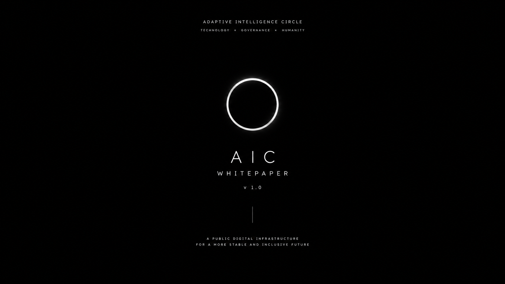

# AIC-Whitepaper
The official whitepaper of AIC | @AdaptiveIntelligenceCircle

**Adaptive Intelligence Circle – Third Path Absolute**

> A foundational ethical AI protocol for civilizational restructuring.

  

## Vision
AIC is not just another AI project. It is an attempt to build the **ethical kernel** at the lowest layer of computing infrastructure, combined with the **Human Meaning Network** to prepare humanity for the post-scarcity era.

## Status
- Whitepaper version: 0.1 (Draft)
- TestNet: Phase 0 (Core) – In development
- License: CC BY-NC-ND 4.0 + GPL-3.0.

## Why CC BY-NC-ND 4.0?
We believe ideas that aim to restructure civilization should belong to humanity.This license requires that reusers give credit to the creator. It allows reusers to copy and distribute the material in any medium or format in unadapted form and for noncommercial purposes only.

---

**Contribution & Contact**
See [CONTRIBUTING.md](CONTRIBUTING.md)

Adaptive Intelligence Circle and Human Meaning Network's whitepaper © 2026 by Nguyen Duc Tri is licensed under CC BY-NC-ND 4.0. To view a copy of this license, visit https://creativecommons.org/licenses/by-nc-nd/4.0/